# Leamington spa

This is a website about the town that I live in, called Leamington Spa. The purpose of the website is to give a brief history of the town, and to give a small insite into what is going on in the town today. My target audience varies from local people who want to know more about the town they live in, to people wanting to visit the town for the first time. 

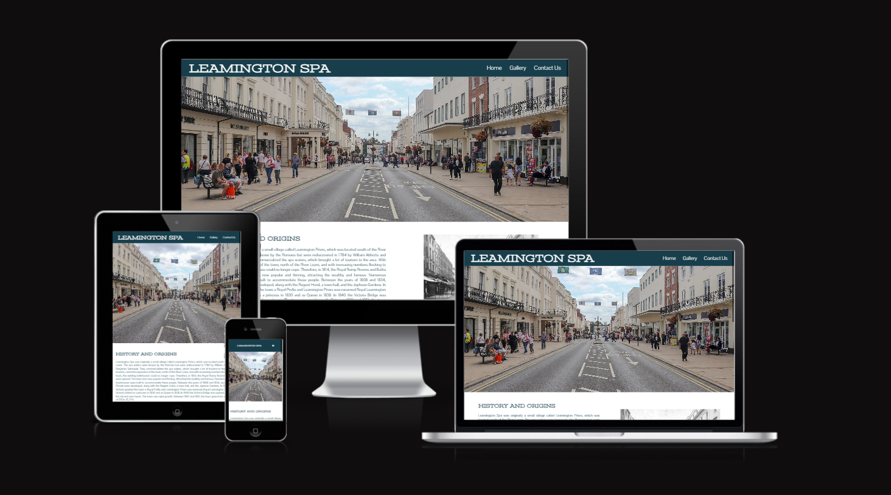

# Features

## Navigation Bar

Featured exactly the same on each page. Includes the logo and links to the Home Page, Gallery and Contact Us pages. This allows easy navigation across all pages.

This is also fully responsive to allow easy navigation across all sizes of screens. I have incorporated a hamburger menu for smaller screens, so that the Navigation bar is not too crowded. The vast majority of my code for the hamburger menu is from the Love Running project.

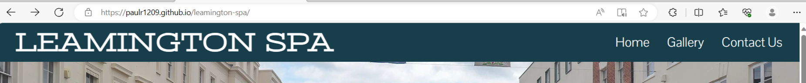

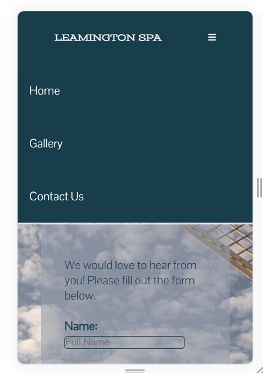

## Hero Image

The hero image is an image of the high street in Leamington spa. I chose this image to catch the users attention, to make them feel like they are the ones standing there looking down.

I found this image on Google Images.

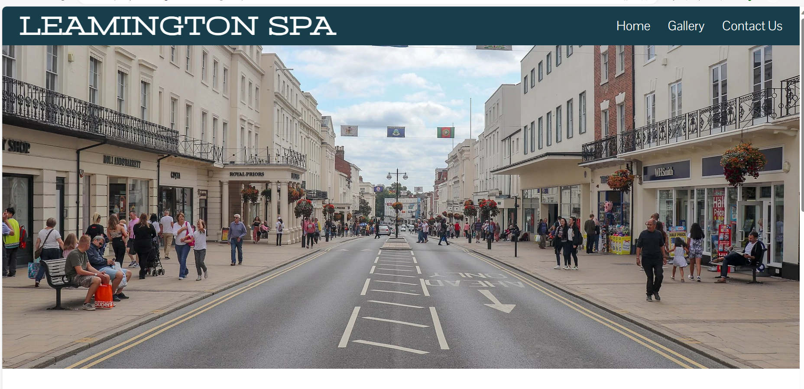

## History and About Leamington Spa

The purpose of this is to show how interesting Leamington Spa is. I believe that Leamington Spa has an intersting history, and also has some really interesting attractions this current day. I want to show this to attract people to come, and also for locals to learn something new.

The history and origins, I found on Wikipedia. The lawn Tennis was a mix of information on Wikipedia, and my own knowledge. Both images were found on Google Images.

The Silicon Spa section was my own knowledge, mixed with Google searches, partnered with an embed YouTube link, which is set to not auto play.

I would like to add new bits of history of the town to this part of the website, and to create a new page, keeping the history on the home page, and creating a 'Whats Going On' page, where I could move 'Silicon Spa' and add more information.

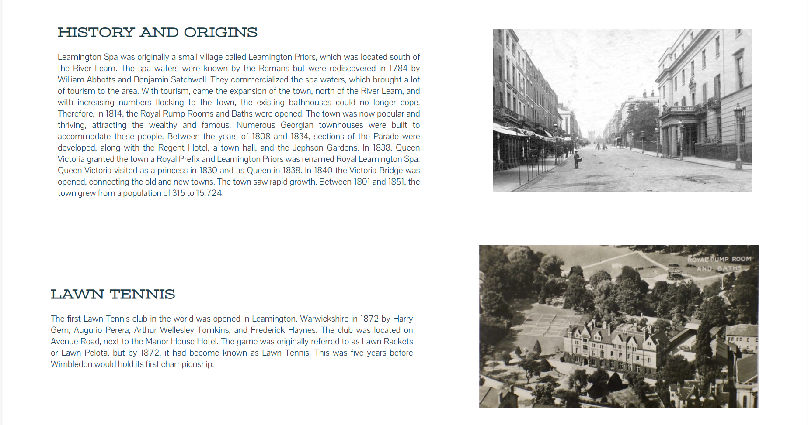

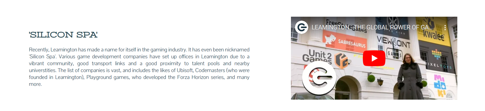

## Footer

The footer includes links to relevant social media websites, which will open in a new tab. The favicons were taken from Font Awesome.

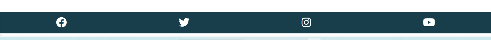

## Gallery

For the Gallery page, I used a simple grid style gallery. I used the code from an idea I found on Stack Overflow, and personalised it to my own needs. I got my images from Google Images.

I added a gallery to showcase the beauty of Leamington Spa to attract people to visit the town.

I also converted all images to webp, using <https://cloudconvert.com/> for faster loading times.

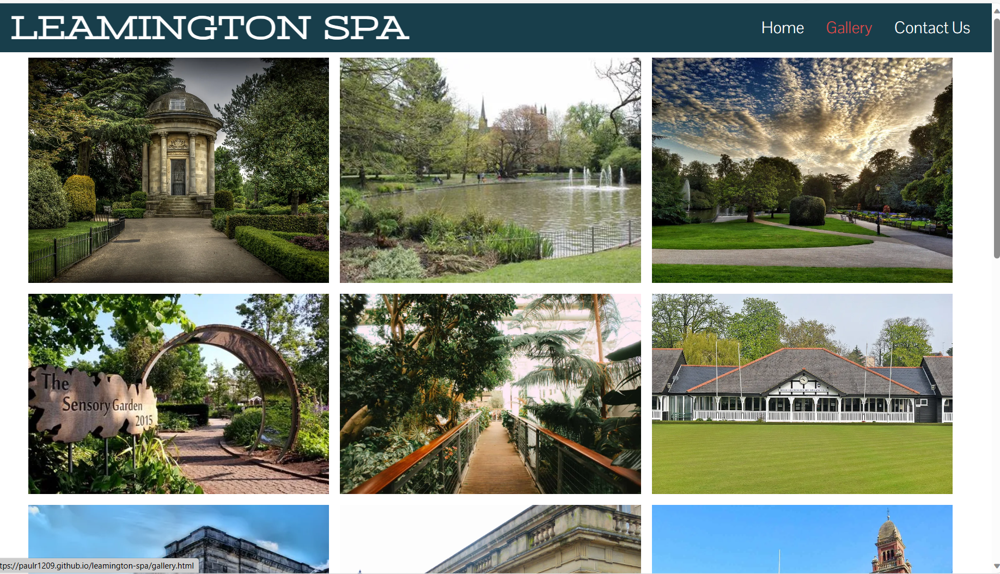

## Contact Us

The contact us page was inspired by the Love Running project. I used the code from the project and persoanlised it to my needs. I got the background image from Google Images.

I got the colour code for the background of my form from <https://html-color.codes/image>

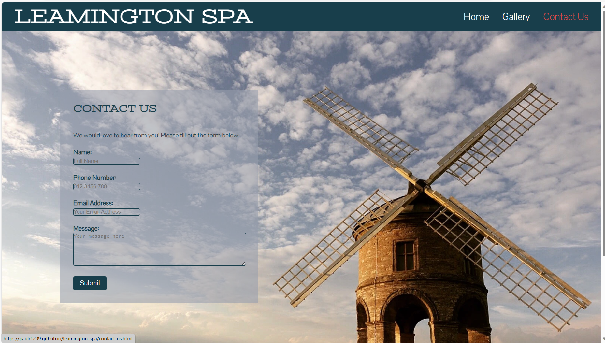

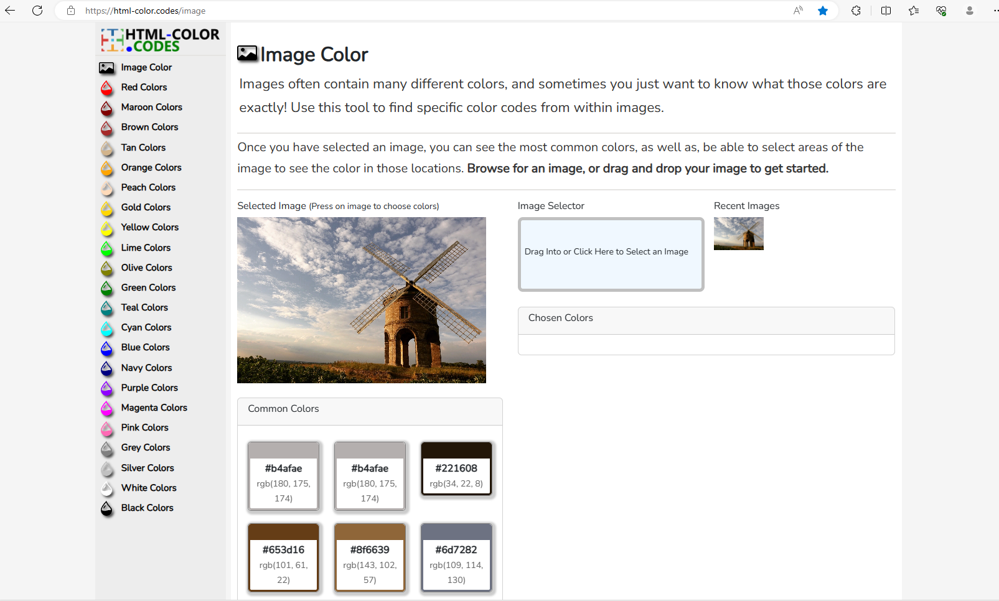

# Testing

## Validators

I tested my code on CSS and HTML validators. My CSS came out with one parse error. This turned out to just be a small error of not closing a bracket, which was an easy fix. They now both have no errors.

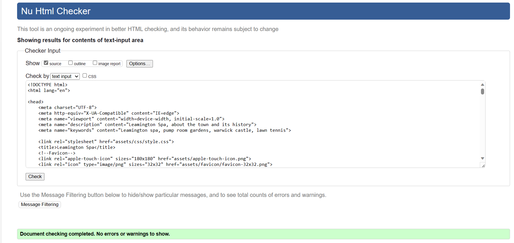

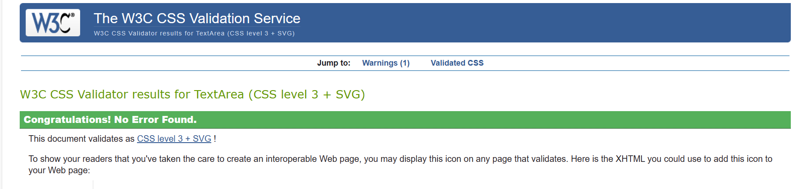

## Lighthouse

I tested my pages on lighthouse for performance and accessibility. Performance is a little slow due to a large amount of images. Best practices score needs more investigating. Everything else is all good.

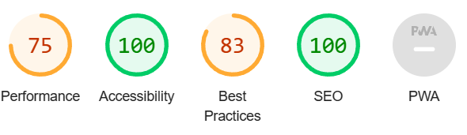

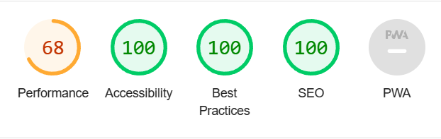

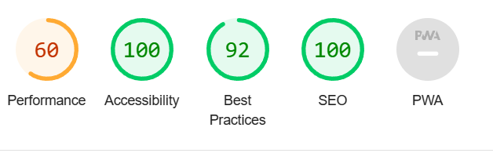

## Manual Testing

I tested the website out on a Lenovo IdeaPad and a Google Pixel 4a 5g.

I tested the Navbar on both screens. On mobile, the width of the Navbar was slightly wider than the content, which caused me to be able to sidescroll. I shortened the width to fix this. Everything else worked as expected.

The Youtube link worked as expected. Video did not autoplay.

Contact us form all working as expected. Data pushed through to Code Institute. Data would not push through without correct fields filled out.

Responsive design all working as expected. Content stacked in the correct order on mobile.

## Bugs

No bugs to report.